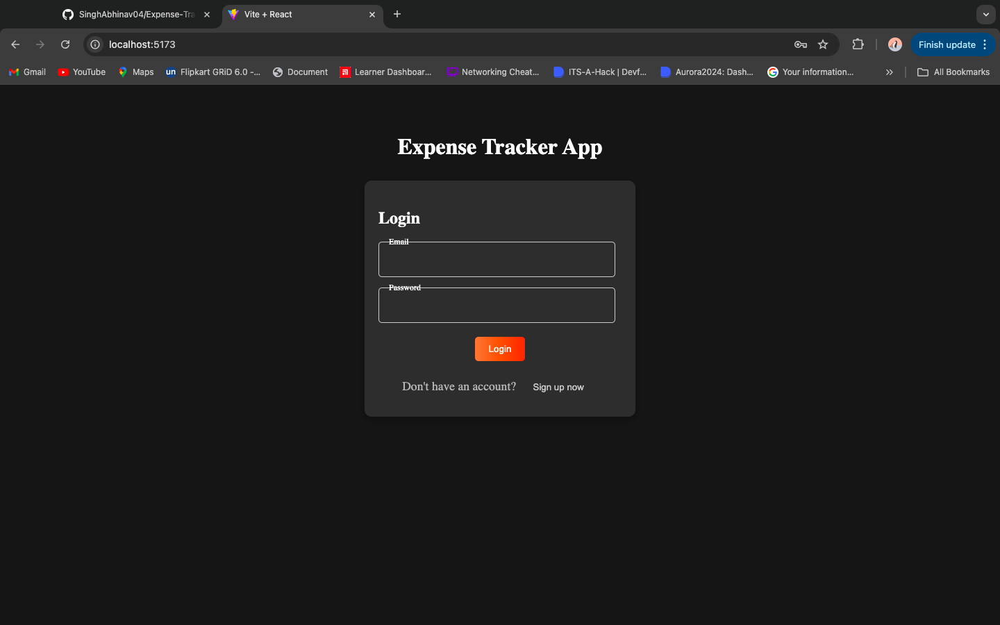
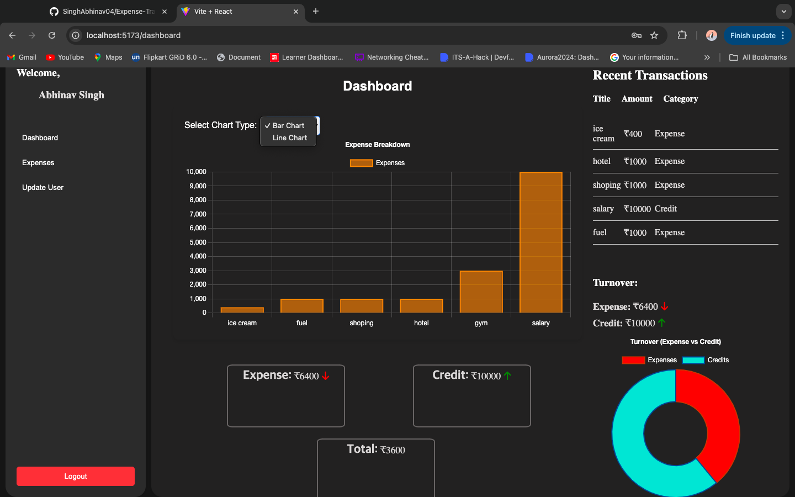
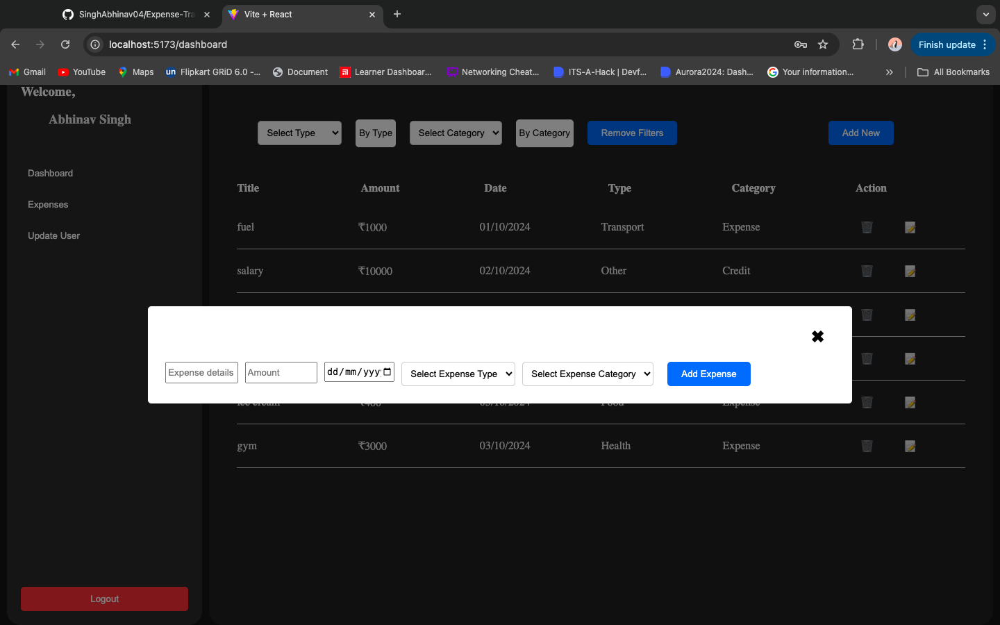
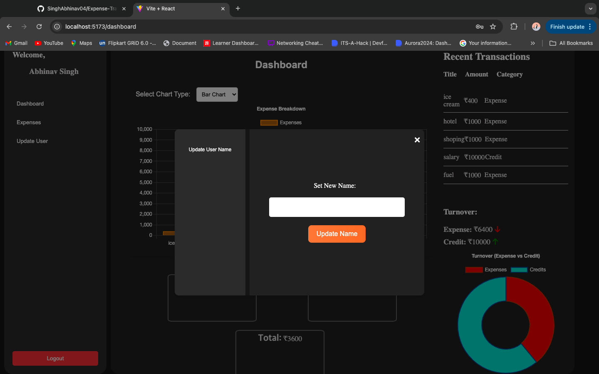

# Personal Finance Tracker

A modern full-stack application to manage personal finances, built with **Java Spring Boot** on the backend and **React** (Vite) on the frontend. This project provides a sleek user interface, enabling users to track and manage their expenses with ease.

## Features

### Backend (Java Spring Boot + MongoDB)
- **JWT Authentication**: Secure token-based authentication for user login.
- **Password Hashing**: Passwords are encrypted using **Bcrypt** for enhanced security.
- **RESTful API**: A clean API structure to handle authentication, expenses, and user data.
- **MongoDB Atlas**: Stores user and transaction data in the cloud.

### Frontend (Vite + React + Chart.js)
- **Modern UI/UX**: Responsive and clean design for a seamless user experience.
- **Signup Requirements**: Passwords must have at least 8 characters, including one capital letter, one number, and one special character.
- **Dashboard**:
    - Displays an interactive chart showing financial insights like total turnover.
    - Lists recent transactions for easy review.
- **Expense Management**:
    - Add, view, edit, and delete expenses.
    - Search and filter expenses by type or category for better management.
- **Sidebar Navigation**:
    - **Dashboard**: Provides an overview with charts and recent transactions.
    - **Expenses**: Manage all your transactions (add, edit, delete, search).
    - **Change Username**: Allows users to update their display name.
    - **Logout**: Securely log out of the application.

## Installation

### Backend Setup
1. Clone the repository and navigate to the backend directory:
   ```bash
   cd Backend/Personal-Finance-Tracker
2. Build and run the Spring Boot application:

   ```bash
   ./mvnw spring-boot:run

## Frontend Setup

1. Navigate to the frontend directory:
   ```bash
   cd Frontend/Expense-Tracker
2. Install the required dependencies:
    ```bash
    npm install

3. Start the development server:
    ```bash
    npm run dev

## Tech Stack

- **Backend**: Java Spring Boot, MongoDB, JWT, Bcrypt
- **Frontend**: Vite, React, Chart.js, CSS
- **Database**: MongoDB Atlas

## Screenshots
### Login Page


### Dashboard


### Expense Page


### Update User Name


## License

This project is licensed under the MIT License - see the [LICENSE](LICENSE) file for details.
